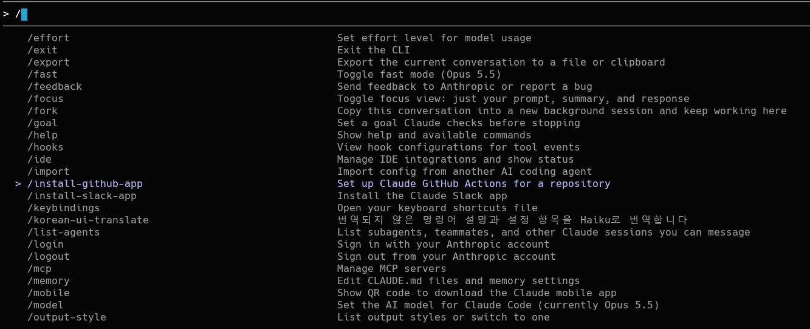
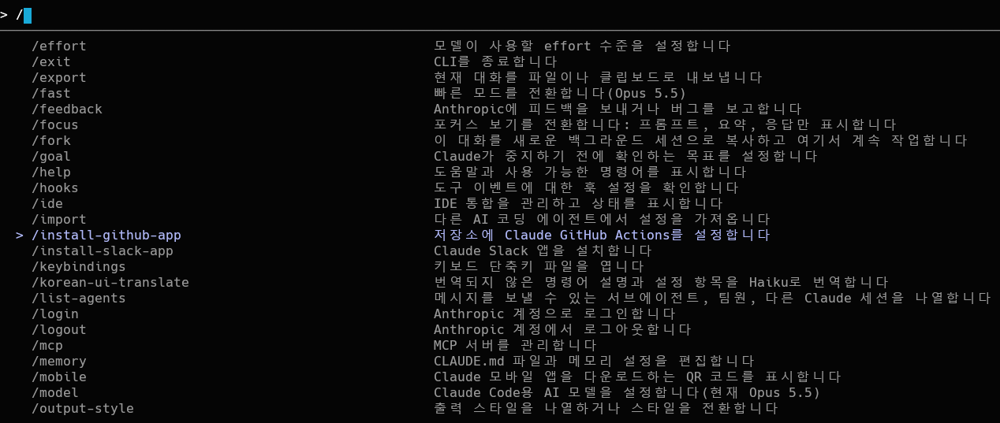
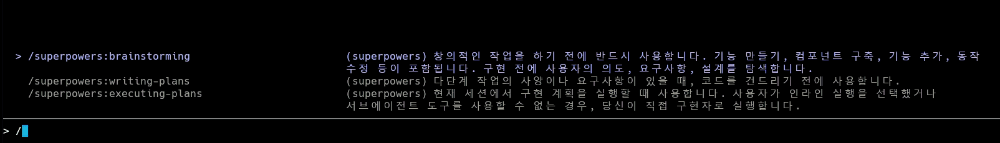
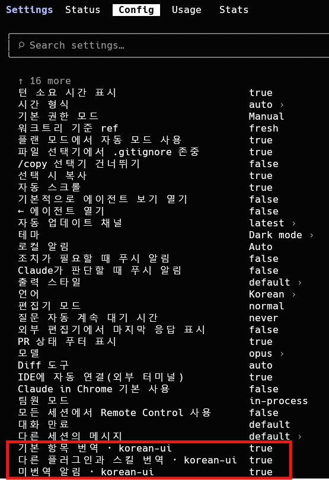

# korean-ui

Claude Code의 명령어 설명과 `/config` 설정 항목을 한국어로 표시하는 플러그인입니다.

  

<p align="center">
  <br>
  <sub>번역 전</sub>
</p>

<p align="center">
  <br>
  <sub>번역 후</sub>
</p>

## 빠른 시작

> [!IMPORTANT]
> Claude Code 2.1.287 이상이 필요합니다. 터미널에서 `claude --version`으로 버전을 확인할 수 있습니다.

Claude Code를 실행한 뒤 다음 두 줄을 입력합니다.

```
/plugin marketplace add KimSuro5773/korean-ui
/plugin install korean-ui@korean-ui
```

설치하면 Claude Code 기본 명령어와 설정 항목이 바로 한국어로 표시됩니다. 실행 중인 세션에 반영되지 않으면 `/reload-plugins`를 실행하거나 세션을 새로 시작합니다.

> [!NOTE]
> mod는 사용자의 권한으로 실행되는 코드입니다. 설치하기 전에 이 플러그인이 하는 일을 확인하려면, 저장소를 내려받은 뒤 `claude plugin validate ./plugins/korean-ui`를 실행합니다. 이 플러그인이 처리하는 이벤트와 호출하는 API 목록이 표시됩니다.

## 무엇이 바뀌나요

### `/` 메뉴와 `/help`

Claude Code 기본 명령어의 설명이 한국어로 표시됩니다.

```
/help      도움말과 사용 가능한 명령어를 표시합니다
/clear     빈 컨텍스트로 새 세션을 시작합니다. 이전 세션은 디스크에 유지됩니다(/resume으로 이어서 진행할 수 있습니다)
/compact   지금까지의 대화를 요약하여 컨텍스트를 확보합니다
/config    설정을 엽니다
```

<p align="center">
  
</p>

### `/config`

기본 설정 항목의 이름이 한국어로 표시되고, 이 플러그인의 설정 항목 세 개가 추가됩니다.

<p align="center">
  
</p>

> [!NOTE]
> 바뀌는 것은 화면에 표시되는 문구뿐입니다. Claude가 스킬을 고를 때 읽는 설명과 스킬 본문은 영어 원문 그대로 전달되므로, 
**스킬이 동작하는 방식에는 영향이 없습니다.**

## 설정

`/config`에서 다음 항목을 켜고 끌 수 있습니다.

| 항목 | 기본값 | 설명 |
|---|---|---|
| 기본 항목 번역 | 켜짐 | Claude Code 기본 명령어와 /config 기본 항목을 한국어로 표시합니다. |
| 다른 플러그인과 스킬 번역 | 꺼짐 | 다른 플러그인의 명령어와 스킬, 직접 만든 스킬, MCP 명령어, 다른 플러그인의 설정 항목을 /korean-ui-translate로 번역한 한국어로 표시합니다. |
| 미번역 알림 | 켜짐 | 번역하도록 켜 둔 항목에 번역되지 않은 문구가 새로 생기면 알림을 표시합니다. |

두 번역 항목을 모두 끄면 모든 문구가 영어 원문으로 표시됩니다.

## 다른 플러그인의 스킬도 번역하기

Claude Code 기본 항목은 설치하자마자 한국어로 표시됩니다. 다른 플러그인의 명령어와 스킬, 업데이트로 새로 생긴 명령어는 `/korean-ui-translate`를 실행하면 Haiku가 번역합니다.

1. `/config`에서 '다른 플러그인과 스킬 번역'을 켭니다. Claude Code 기본 항목만 번역하려면 이 단계는 건너뜁니다.
2. `/korean-ui-translate`를 실행합니다. 

- 번역 결과는 이 컴퓨터에만 저장됩니다.
- 번역에 실패한 문구가 있으면 결과 끝에 그 문구를 보여 주고, 다음에 실행할 때 다시 번역합니다.
- 영어 원문이 바뀐 항목은 다시 번역되지 않은 상태가 됩니다. 그래서 이전 문구를 옮긴 번역이 잘못 표시되지 않습니다.

> [!TIP]
> "번역되지 않은 문구가 N개 있습니다"라는 알림이 보이면 `/korean-ui-translate`를 한 번 실행합니다. 주로 새 플러그인을 설치했거나 Claude Code가 업데이트된 뒤에 나타납니다.


> [!WARNING]
> `/korean-ui-translate`는 사용자 계정으로 Haiku 모델을 호출하므로 사용량이 소모됩니다.

## 업데이트

이 마켓플레이스는 자동 업데이트가 기본으로 꺼져 있습니다. 새 버전은 다음 명령어로 받습니다.

```
claude plugin update korean-ui@korean-ui
```

자동 업데이트를 켜려면 `/plugin`을 실행하고 **Marketplaces** 탭에서 `korean-ui`를 선택한 뒤 **Enable auto-update**를 선택합니다. 자동 업데이트를 켜면, 세션에서 첫 메시지를 보낸 뒤 백그라운드에서 새 버전을 받아 둡니다. 실행 중인 세션에는 `/reload-plugins`를 실행해야 적용되고, 다음 세션부터는 자동으로 적용됩니다.

## 지원 환경

| 환경 | 번역 표시 |
|---|---|
| 터미널의 Claude Code | 확인함 (Windows 터미널, Claude Code 2.1.292) |
| Desktop 앱의 Code 탭 | 확인하지 않음 |
| VS Code 확장 | 확인하지 않음 |

## 질문

**Q. 번역이 표시되지 않아요.**

mods가 꺼져 있으면 이 플러그인이 동작하지 않습니다. `disableAllHooks` 설정을 켰거나 `--safe-mode`, `--bare`로 실행했는지 확인합니다. Claude Code가 업데이트되어 mods의 기능이 바뀐 경우에도 번역이 표시되지 않을 수 있으니, 플러그인의 새 버전이 있는지 확인합니다.

**Q. `/config`의 선택지 값이나 명령어 뒤의 `[key=value ...]`는 왜 영어인가요?**

선택지 값(예: `dark`, `light`)과 인자 힌트는 mods의 기능으로 바꿀 수 없는 부분이라 영어로 표시됩니다.

**Q. 기본 설정 항목에는 설명이 없어요.**

Claude Code가 기본 설정 항목에 도움말을 제공하지 않으므로, 기본 설정 항목은 이름만 번역됩니다.

**Q. 번역한 명령어가 영어 단어로 검색되지 않아요.**

번역한 명령어는 영어 설명에 있는 단어로는 검색되지 않습니다. 명령어 이름으로 검색합니다.

**Q. Claude Code를 업데이트했더니 일부 설명이 영어로 보여요.**

업데이트로 원문이 바뀐 항목입니다. 플러그인을 업데이트하거나 `/korean-ui-translate`를 실행하면 다시 한국어로 표시됩니다.

**Q. `claude-api`처럼 번역되지 않는 스킬 설명이 있어요.**

여러 줄로 된 스킬 설명은 Claude가 스킬을 고를 때 쓰는 지시문이므로 번역하지 않습니다.

**Q. `/sandbox`의 설명이 다시 영어로 보여요.**

`/sandbox`처럼 현재 상태가 설명에 들어가는 명령어는 상태마다 원문이 달라서 따로 번역됩니다. 미번역 알림이 보이면 `/korean-ui-translate`를 실행합니다.

**Q. Claude에게도 한국어 설명이 전달되나요?**

전달되지 않습니다. 이 플러그인은 Claude에게 보내는 스킬 목록에서 번역문을 영어 원문으로 되돌립니다. 다만 Claude Code가 업데이트되어 스킬 목록의 형식이 바뀌면, 플러그인을 고치기 전까지 한국어 설명이 전달될 수 있습니다. 이런 경우가 걱정되면 플러그인의 새 버전이 나올 때까지 `/config`에서 번역을 꺼 둡니다.


## 라이선스

[MIT](LICENSE)
